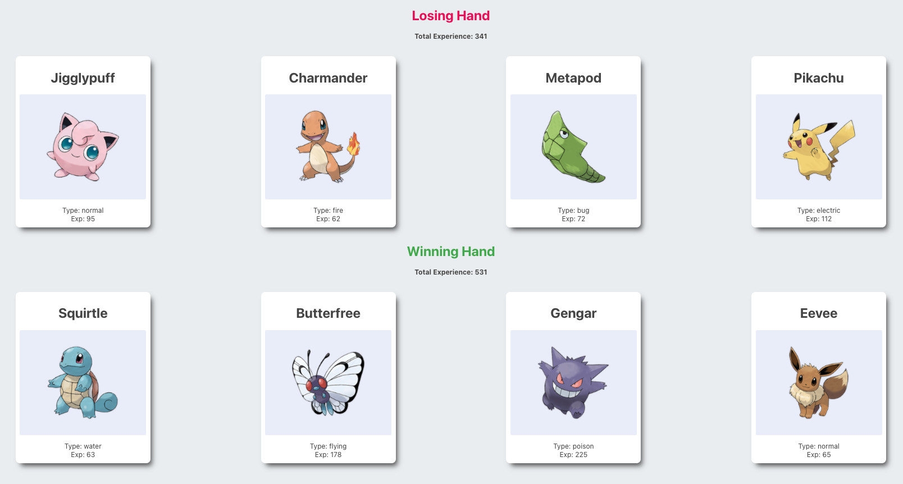

# Pokedex

This project was made using React components and properties.
It displays an interface that looks like this:

The project uses 3 components:

### Pokegame

determines which hand is the “winner,” where the winning hand is the one with the higher total experience.

### Pokedex

Is provided, via props, an array of objects describing different pokemon, and renders a series of Pokecard components.

### Pokecard

Shows a single Pokemon, with their name, image, and type.

The poke images are from here: https://assets.pokemon.com/assets/cms2/img/pokedex/detail/${id}.png
